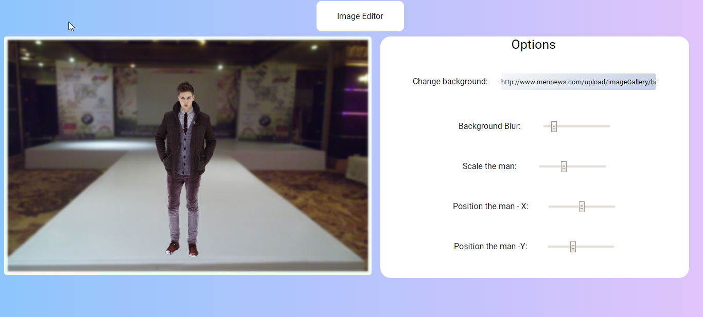

# JS-Image-Editor
This image editor has options to change background-blur , scale,Position -X and Position -Y. 
You can scale,position-x ,position-y of image(man) 
You can change background image but giving input the change backgroud section 
You can add blur to the background image 
## Below is start screenshot.
 
 

 
## After edit
 

