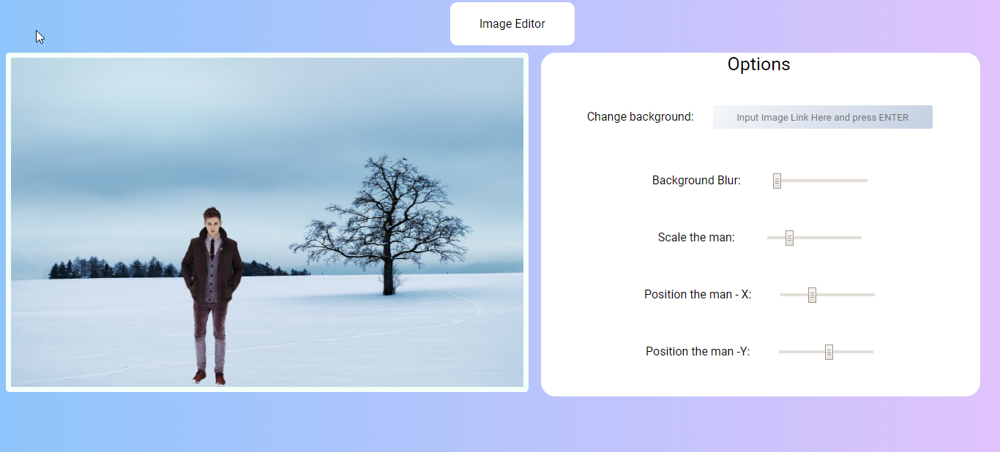

# JS-Image-Editor
This image editor has options to change background-blur , scale,Position -X and Position -Y
You can scale,position-x ,position-y of image(man)
You can change background image but giving input the change backgroud section
You can add blur to the background image
Below is start screenshot.

After edit

